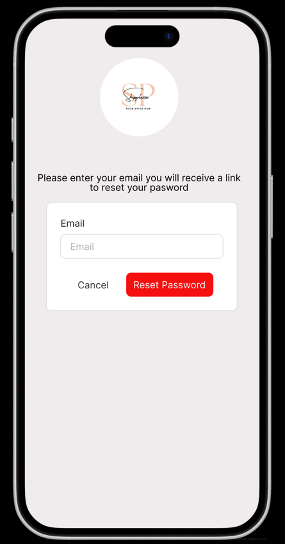
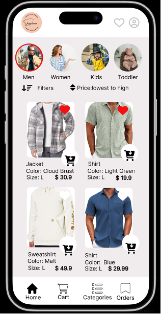
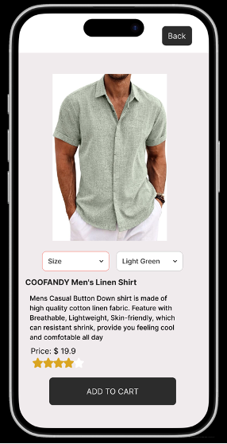
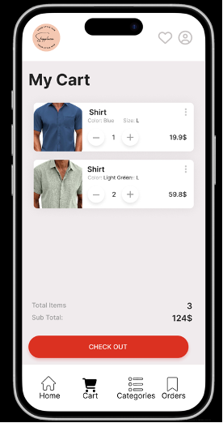
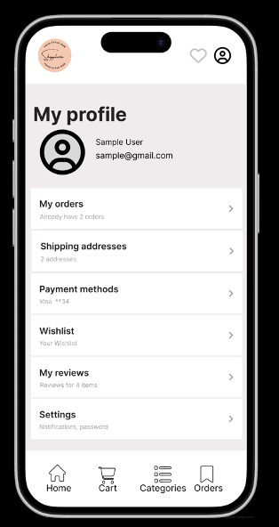

# 🛒 ShopPlaza

**ShopPlaza** is a full-featured cross-platform e-commerce mobile application built using **React Native**. It supports both Android and iOS platforms and provides a modern shopping experience including category-based product browsing, cart management, and user authentication.

> 🛠 This entire project, including both frontend and backend, was **developed solely by Karthik Rachoori** as part of an academic and personal learning initiative.

------------------------------------------------------------------------

## 🚀 Features

-   🔐 **Authentication**
    -   Login / Signup
    -   Forgot Password support
-   🛍️ **Shopping**
    -   Browse products by categories (Men, Women, Kids, Toddler)
    -   Add items to cart
    -   Responsive layout and smooth navigation
-   🧾 **Product Catalog**
    -   Category filtering
    -   Product images, descriptions, and details
-   📦 **Backend API Integration**
    -   Integrated with Express.js + MySQL backend

------------------------------------------------------------------------

## 📂 Folder Structure

```         
ShopPlaza/
├── assets/                # Images and SVG icons
├── backend/               # Node.js + Express backend API
├── src/                   # React Native components
│   ├── Components/        # Login, Signup, Cart, Categories, etc.
├── android/               # Android native code
├── ios/                   # iOS native code
├── App.js                 # Main entry point
├── app.json               # App metadata
├── package.json           # Dependencies and scripts
└── .gitignore             # Git exclusions
```

------------------------------------------------------------------------

## 🧰 Tech Stack

| Layer     | Tools / Libraries                          |
|-----------|--------------------------------------------|
| Frontend  | React Native, TypeScript, React Navigation |
| Backend   | Node.js, Express, MySQL                    |
| Utilities | Metro, Watchman, Xcode, Android Studio     |

------------------------------------------------------------------------

## 🛠️ Getting Started

### Prerequisites

-   Node.js
-   Xcode (for iOS)
-   Android Studio (for Android)
-   CocoaPods (`sudo gem install cocoapods`)
-   Watchman (`brew install watchman`)

### Installation

``` bash
# Clone the repo
git clone https://github.com/KarthikRachoori/ShopPlaza.git
cd ShopPlaza

# Install dependencies
npm install

# Install iOS pods
cd ios && pod install && cd ..
```

### Running the App

``` bash
# Start Metro
npm start

# Run on iOS
npx react-native run-ios

# Run on Android
npx react-native run-android
```

------------------------------------------------------------------------

## 🧪 Testing

Test setup coming soon. Basic structure is in place under `__tests__/`.

``` bash
npm test
```

------------------------------------------------------------------------

## 🚫 Sensitive Files to Ignore

Ensure you do **not commit** the following files:

-   `android/app/debug.keystore`
-   `ios/.xcode.env`
-   `.env` or secret config files

Already excluded in `.gitignore`.

------------------------------------------------------------------------

## 📸 Screenshots !

### Login Page

###  

### Forgot Password

\


### Home Page

###  

### 

### Product Details page

###  

### Cart page

###  

### Profile Page  

------------------------------------------------------------------------

## 👨‍💻 Developer

**Karthik Rachoori**\
[GitHub](https://github.com/KarthikRachoori) • [LinkedIn](https://www.linkedin.com/in/karthikrachoori)

------------------------------------------------------------------------

## 📄 License

This project is licensed under the [MIT License](LICENSE).
